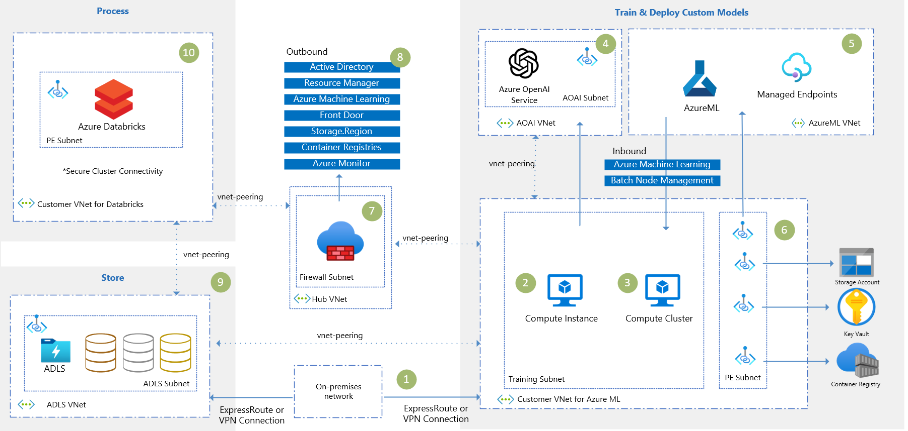

[!INCLUDE [header_file](../../../includes/sol-idea-header.md)]

This solution outlines a secure machine learning architecture aimed at Banks and other Financial Institutions. It is designed to help you take your machine-learning workloads to the cloud in an agile and secure fashion. AzureML and Azure Databricks form the core of the solution. This platform works seamlessly with other services, such as Azure Data Lake Storage Gen2, Azure Data Factory, Azure Synapse Analytics, and Power BI.

## Architecture

*Download a [Visio file](https://arch-center.azureedge.net/fsi-vteam-secure-data-science.vsdx) of this architecture.*

<!-- LINK to Visio File: https://microsoft.sharepoint.com/:u:/t/AIFSIAmericas/EbvEs9xDW-lAnpO3P_xIYIsB_hGA9YUiUXCvRRYm9dMM6A?e=6JSguy -->

### Dataflow

1. Users connect to the Data Science & Machine Learning environment through a VPN Connection or an ExpressRoute link. This is a secure connection that allows the users to access the Azure resources.

2. They work in Compute Instances created within a secure Azure ML Workspace to train Machine Learning models (alternatively, they can choose to work on Databricks Workspaces as well).

3. To enable outbound internet access from your private computing resources, you can use a hub VNet that houses your firewall. The hub VNet can be peered with the VNet that houses your Azure Machine Learning workspace. This allows the Azure Machine Learning workspace to communicate with the firewall. The firewall can then be configured to allow outbound internet access from the Azure Machine Learning workspace.

4. The inbound and outbound network traffic is configured according to the public internet access requirements. Some service tags are registered to allow proper traffic according to the [documentation](https://learn.microsoft.com/en-us/azure/machine-learning/how-to-secure-workspace-vnet?tabs=required%2Cpe%2Ccli).

5. All resources (Azure ML Workspace, Storage Account, AKV, and ACR) use private endpoints allocated in a customer VNet to ensure the private traffic.

6. The customer VNet for Azure ML can also communicate with other VNets through peering. For example, it is essential to securely connect to a Data Lake storage to use the data from different layers: bronze, silver, and gold, when developing ML models.

7. Once the Data Scientists concluded their experiments in the Compute instances they can move forward with implementing the pipelines using more robust computation (Compute Clusters). 

8. They can also deploy the models for Batch or Real-Time consumption through Inference endpoints deployed on Managed Online Endpoints. All these endpoints are secured by Private Endpoints connected with the other Azure ML resources.

9. A secure Databricks environment can also be used along with the other services to provide more data processing capabilities using the Spark engine. You can also leverage this integration to monitor Azure Databricks runs, register models, and deploy them in Azure Machine Learning.

### Components

> A bullet list of components in the architecture (including all relevant Azure services) with links to the product service pages. This is for lead generation (what business, marketing, and PG want). It helps drive revenue.

> Why is each component there?
> What does it do and why was it necessary?
> Link the name of the service (via embedded link) to the service's product service page. Be sure to exclude the localization part of the URL (such as "en-US/").

Example: 
* [Resource Groups][resource-groups] is a logical container for Azure resources.  We use resource groups to organize everything related to this project in the Azure console.

## Scenario details

> This should be an explanation of the business problem and why this scenario was built to solve it.
>> What prompted them to solve the problem?
>> What services were used in building out this solution?
>> What does this example scenario show? What are the customer's goals?

> What were the benefits of implementing the solution?

### Potential use cases

This solution is aimed at financial services companies such as banks, insurers, and capital market companies that want to gain agility and efficiency by bringing their data science workloads to the cloud, but with particular attention to the solution's security.
 
In addition to companies in the FSI segment, other businesses interested in creating a secure data science environment in the cloud can also benefit from this solution. 

## Contributors

> (Expected, but this section is optional if all the contributors would prefer to not include it)

> Start with the explanation text (same for every section), in italics. This makes it clear that Microsoft takes responsibility for the article (not the one contributor). Then include the "Pricipal authors" list and the "Other contributors" list, if there are additional contributors (all in plain text, not italics or bold). Link each contributor's name to the person's LinkedIn profile. After the name, place a pipe symbol ("|") with spaces, and then enter the person's title. We don't include the person's company, MVP status, or links to additional profiles (to minimize edits/updates). Implement this format:

*This article is maintained by Microsoft. It was originally written by the following contributors.*

Principal authors: > Only the primary authors. Listed alphabetically by last name. Use this format: Fname Lname. If the article gets rewritten, keep the original authors and add in the new one(s).

 - [Author 1 Name](http://linkedin.com/ProfileURL) | Title, such as "Cloud Solution Architect"
 - [Author 2 Name](http://linkedin.com/ProfileURL) | Title, such as "Cloud Solution Architect"
 - > Continue for each primary author (even if there are 10 of them).

Other contributors: > (If applicable.) Include contributing (but not primary) authors, major editors (not minor edits), and technical reviewers. Listed alphabetically by last name. Use this format: Fname Lname. It's okay to add in newer contributors.

 - [Contributor 1 Name](http://linkedin.com/ProfileURL) | Title, such as "Cloud Solution Architect"
 - [Contributor 2 Name](http://linkedin.com/ProfileURL) | Title, such as "Cloud Solution Architect"
 - > Continue for each additional contributor (even if there are 10 of them).

*To see non-public LinkedIn profiles, sign in to LinkedIn.*

## Next steps

> Links to articles on Microsoft Learn. Could also be to appropriate sources outside of Learn, such as third-party documentation, GitHub repos, or an official technical blog post.

Examples:
* [Azure Kubernetes Service (AKS) documentation](/azure/aks)
* [Azure Machine Learning documentation](/azure/machine-learning)
* [What are Azure Cognitive Services?](/azure/cognitive-services/what-are-cognitive-services)

## Related resources

> Use "Related resources" for architecture information that's relevant to the current article. It must be content that the Azure Architecture Center TOC refers to, but may be from a repo other than the AAC repo.
> Links to articles in the AAC repo should be repo-relative, for example (../../solution-ideas/articles/article-name.yml).

> Here are example sections:

Related architecture guides:

* [Artificial intelligence (AI) - Architectural overview](/azure/architecture/data-guide/big-data/ai-overview)
* [Choosing a Microsoft cognitive services technology](/azure/architecture/data-guide/technology-choices/cognitive-services)

Fully deployable architectures:

* [Chatbot for hotel reservations](/azure/architecture/example-scenario/ai/commerce-chatbot)
* [Build an enterprise-grade conversational bot](/azure/architecture/reference-architectures/ai/conversational-bot)
* [Speech-to-text conversion](/azure/architecture/reference-architectures/ai/speech-ai-ingestion)